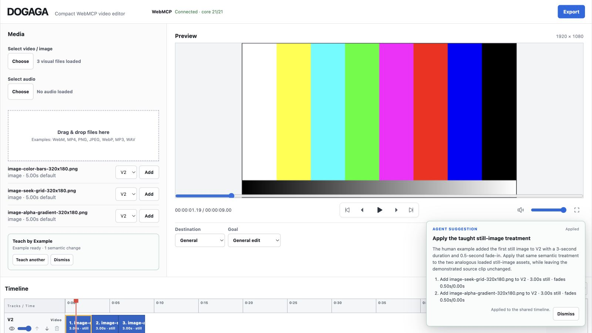

# DOGAGA

DOGAGA is a **lightweight, local-first video editor that runs in a desktop browser**.

Rather than recreating a full professional NLE such as Premiere Pro, DOGAGA aims to be a compact editor for music videos, promotional videos, short-form clips, lyric videos, Spotify Canvas loops, and similar small projects.

The WebMCP Challenge 2026 accelerated development, but DOGAGA is not a challenge-only demo. The public app is the evolving **compact production v0**.

[](https://dogaga.pages.dev)

## Public build

- Live app: https://dogaga.pages.dev
- Repository: https://github.com/yo4e/DOGAGA
- License: MIT

The public build is deployed on Cloudflare Pages from `main`.

## The WebMCP collaboration idea

DOGAGA's human UI and WebMCP agent operate on the **same live editor state and the same command executor**. There is no separate agent timeline or remote MCP editing backend.

The final Challenge collaboration story is:

> **Human teaches → DOGAGA captures semantic meaning → Agent generalizes → Human approves**

A person can use **Teach by Example** to demonstrate a normal edit. DOGAGA records supported before/after changes semantically—not as mouse-event macros—and exposes the resulting agent-safe `humanDemonstration` through `get_project_state`.

The person can then ask the agent to generalize that treatment, for example:

> Do the same to the other still images.

The agent can submit a structured `propose_edit_plan`. DOGAGA validates the proposal without mutating the project and shows it as an app-owned suggestion. The timeline changes only when the person clicks **Apply**; **Reject** leaves it untouched.

This keeps agent reasoning, human intent, and the visual editor synchronized on one open web page.

See [Human–agent collaboration](docs/AGENT_COLLABORATION.md).

## Current capabilities

### Editing

- Load local video, PNG/JPEG/WebP still-image, and audio files
- Multiple video tracks (V1 / V2 / ...) and audio tracks (A1 / A2 / ...)
- Add and reorder video/audio tracks
- Toggle video track visibility and set track opacity
- Mute audio tracks
- Move visual clips between video tracks
- Add, reorder, trim, and delete video clips
- Add still images as visual clips with adjustable display duration (5 seconds by default)
- Preserve transparent PNG overlays so higher video tracks can reveal lower tracks beneath them
- Split a video clip at the current playhead position
- `⌘K` / `Ctrl+K` to split the selected video clip at the playhead
- `Shift+D` to toggle a 0.5-second cross-dissolve between the selected clip and the next clip on the same track
- Change video clip playback speed (0.25× / 0.5× / 0.75× / 1× / 1.25× / 1.5× / 2×)
- Set visual clip fade-in / fade-out (none / 0.25s / 0.5s / 1s / 2s)
- Set audio start position and volume, or remove an audio clip
- Add and remove cross-dissolves
- Multi-track timeline scaled to real time
- Playhead seeking
- Timeline zoom/density controls

Still images intentionally use display duration instead of source trim, split, or playback speed.

### Preview

- Play, pause, and seek actual local video
- Composite multiple video and still-image layers
- Preserve PNG alpha transparency in layered Preview
- Apply video track opacity and visibility immediately
- Continue playback across clip boundaries
- Reflect trim, split, speed, still duration, fade, move, and delete operations immediately
- Play multiple audio tracks simultaneously and respect mute state
- Combine clip fades and cross-dissolves through the same opacity calculation
- Project canvas presets: 16:9 / 9:16 / 1:1 / 4:5
- Source fitting: contain / cover

Higher-order video tracks render above lower-order tracks. Cross-dissolves can only be created between adjacent clips on the same video track.

### Export

- Export the current multi-track video/still-image/audio project entirely in the browser
- Composite video and still-image layers, including transparent PNG overlays
- Respect video track order, opacity, and visibility
- Mix multiple audio tracks through Web Audio, including track mute and clip volume
- Respect trim, split, playback speed, still-image duration, fades, clip order, canvas preset, contain/cover, and cross-dissolves
- Browser-native `canvas.captureStream()` + Web Audio + MediaRecorder pipeline
- Prefer MP4 when supported and fall back to WebM when needed
- No server upload
- Progress, cancel, and download controls

DOGAGA currently exports the normal composited result; it does not export an alpha-channel video.

## WebMCP surface

The editing page exposes **23 WebMCP tools**.

### Core and collaboration

- `get_project_state`
- `propose_edit_plan`
- `add_track`
- `remove_track`
- `move_track`
- `set_track_opacity`
- `set_track_visibility`
- `set_track_mute`
- `add_clip`
- `move_clip`
- `move_clip_to_track`
- `trim_clip`
- `split_clip`
- `set_clip_speed`
- `set_clip_fade`
- `delete_clip`
- `set_audio`
- `clear_audio`
- `set_canvas`
- `add_transition`
- `remove_transition`

### Still-image specific

- `add_image_clip`
- `set_still_duration`

Existing tool behavior remains compatible: omitting `trackId` in `add_clip` targets V1, while omitting it in `set_audio` / `clear_audio` targets A1. Image assets use `add_image_clip`; their display duration can be changed with `set_still_duration`.

All mutation tools go through the same `EditorController` and command executor used by the human UI.

## Project Brief, Teach by Example, and Edit Plans

DOGAGA exposes a small agent-safe **Project Brief** (`Destination` + `Goal`). An agent can inspect that intent together with the live editor state and recommend destination-aware changes.

Teach by Example can capture supported semantic changes such as:

- adding a loaded visual to a video track
- clip move/reorder
- still-image display duration
- video playback speed
- clip fades
- video-track opacity / visibility
- audio-track mute
- canvas preset / fit mode

The private before-snapshot used while teaching is never exposed to the agent. `get_project_state` receives only the semantic result.

`propose_edit_plan` supports reviewable multi-step operations including `add_visual_clip`, still duration, canvas, track settings, clip movement, trim, speed, and fades. A proposal is validated non-mutatingly. **Apply** revalidates and commits atomically; **Reject** leaves the timeline unchanged.

See:

- [Human–agent collaboration](docs/AGENT_COLLABORATION.md)
- [Current architecture](docs/ARCHITECTURE.md)

## Privacy / local-first design

Source video, still images, and audio are not uploaded to a DOGAGA server during normal editing or export.

The browser runtime keeps `File` objects and object URLs during the current session, but these are excluded from WebMCP state.

The agent-safe state does not include:

- `File`
- `FileSystemFileHandle`
- absolute paths
- object URLs
- local filesystem information
- media pixels
- private Teach by Example snapshots

Image/video/audio assets are exposed only through safe descriptors such as asset ID, kind, name, duration, and dimensions.

See [Privacy and local-data boundary](docs/PRIVACY_AND_DATA_BOUNDARY.md).

## Browser support

- Desktop Chrome is the primary reference environment for the manual editor, Preview, and Export
- Challenge judges can test WebMCP using ChatGPT's in-app browser or Chrome with WebMCP enabled
- Browsers without WebMCP support can still use the manual editor, actual Preview, and Export

See [WebMCP browser compatibility](docs/WEBMCP_BROWSER_COMPATIBILITY.md) for details and validation steps.

## Local development

Node.js 22 is recommended.

After a fresh clone, use `npm ci` so dependencies match the lockfile exactly.

```bash
git clone https://github.com/yo4e/DOGAGA.git
cd DOGAGA
npm ci
npm run dev
```

Validation:

```bash
npm run typecheck
npm test
npm run build
```

The production build output is `dist/`.

GitHub Actions uses the same clean-checkout + Node.js 22 + `npm ci` validation path.

## Current limitations

Compact production v0 intentionally limits scope. Major current limitations include:

- No persistent editing sessions or media relinking yet
- No video/audio track lock UI yet
- No audio clip fade or playback-speed controls yet
- No arbitrary clip positioning, gaps, or drag trimming yet
- No waveform, lyrics, captions, or advanced effects yet
- Still images do not yet have image-specific motion/effects such as Ken Burns animation
- Frame-perfect professional NLE precision is not a goal for this version

The immediate priority around the Challenge submission is stability, supported-host WebMCP QA, accurate reviewer documentation, and a clear demo—not additional normal editor features.

## WebMCP Challenge 2026

DOGAGA existed before August 25, 2026. The repository history documents that prior work.

During the Challenge period, DOGAGA was meaningfully extended with:

- browser-native WebMCP shared-state architecture
- agent-safe editor state and semantic command schemas
- real local-media Preview connected to that same state
- browser-native video export/download
- canonical multi-track video/audio editing
- playback speed, fades, split, and cross-dissolves
- track opacity/visibility and multi-audio mixing
- destination-aware Project Brief
- non-mutating, human-reviewable `propose_edit_plan`
- still-image and transparent-PNG support in editing, Preview, Export, and WebMCP
- Teach by Example semantic human demonstrations
- final 23-tool WebMCP surface

The Challenge submission uses the public DOGAGA app itself rather than a separate fixed demo application.

## Judge-friendly WebMCP test

Recommended production scenario:

1. Open `https://dogaga.pages.dev` in a supported WebMCP host.
2. Load 3 still images with the normal human UI.
3. Create/select V2.
4. Click **Teach agent**.
5. Add one still to V2 and give it a visible treatment such as 3.00 s duration + 0.50 s fade.
6. Click **Stop teaching** and confirm the **Human example** column shows the recorded semantic example.
7. Ask the agent to read the DOGAGA project state.
8. Ask: **“Do the same to the other still images.”**
9. Confirm the agent submits a reviewable Edit Plan rather than mutating automatically.
10. Click **Apply** and confirm the shared timeline/Preview changes.
11. Export a short downloadable result if desired.

This directly demonstrates:

> **Human teaches → Agent generalizes → Human approves**

## Documentation for reviewers

For the current public build and WebMCP Challenge evaluation, use these English documents:

- [Documentation guide](docs/README.md)
- [Current architecture](docs/ARCHITECTURE.md)
- [Human–agent collaboration](docs/AGENT_COLLABORATION.md)
- [Still-image support](docs/STILL_IMAGE_SUPPORT.md)
- [WebMCP browser compatibility](docs/WEBMCP_BROWSER_COMPATIBILITY.md)
- [Privacy and local-data boundary](docs/PRIVACY_AND_DATA_BOUNDARY.md)
- [Devpost submission draft](docs/DEVPOST_SUBMISSION_DRAFT.md)
- [Challenge demo video script](docs/CHALLENGE_DEMO_VIDEO_SCRIPT.md)

The repository intentionally retains older Japanese design notes, research, ADRs, and Issue history as development history. Some describe earlier stages or future features and are not the primary documentation for the current submitted build.

## Long-term vision

The long-term goal is a browser-only workflow that can handle:

> Place a song, arrange footage and stills, synchronize lyrics, style text, apply a small amount of processing, and export for the intended destination.

DOGAGA is not intended to become an all-purpose professional editor. The goal is a small editor with enough power for music-centered video work.
